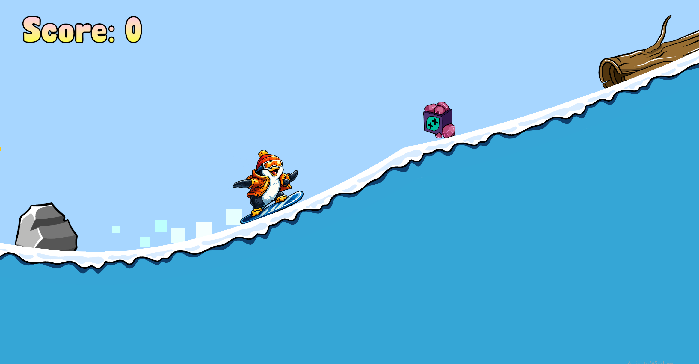

# Snow Surfer 2D 
Side View 2D Snow Surfer Game Prototype created via Unity 6. 
The prototype only includes 1 playable level with fully functioning features, such as: Lose/Win, Score, Character Selection, Particles, Player Controls, Collision. 

## Screenshots

## To Play the Game 
Clone the repository to run the project using Unity. The exe. file is not included since this is a 1 level prototype and not a full game.

## Controls
- LEFT and RIGHT Arrow Keys (or A and D) for rotating the player to get flip points.
- UP Arrow Key (or W) to speed up the player.

## Tools used while developing this project
- Unity 6
- Visual Studio Code. Coding in C# Programming Language.
- GitBash.

## Contacts 
- E-mail address orkhan.elchuev@gmail.com
## Acknowledgements
- [dafont](https://www.dafont.com/de/)

